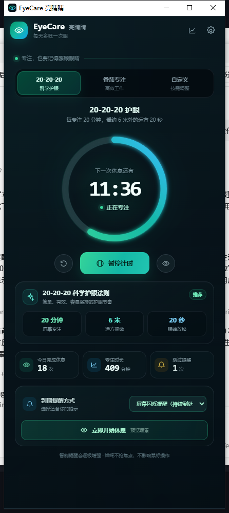
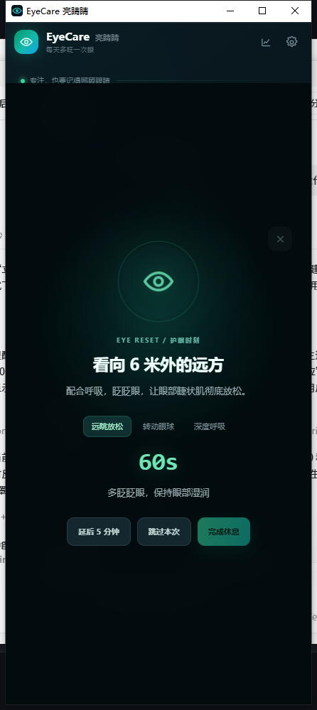
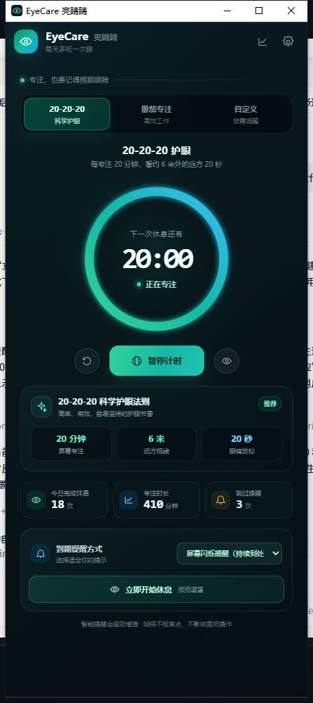

# EyeCare 亮睛睛

> 申报版本：EyeCare 亮睛睛护眼提醒软件 V1.0
>
> 著作权人：`[请填写个人姓名或公司全称]`

一个开源、免费的 Windows 护眼提醒桌面程序，帮助你按 20-20-20 规则定时休息眼睛。它支持托盘运行、番茄护眼、自定义计时，以及倒计时结束后的人工确认休息遮挡。

[](LICENSE)
[](https://github.com/shayuye2010/EyeCare/releases/latest)
[](https://github.com/shayuye2010/EyeCare/stargazers)

## 下载

普通用户不需要安装 Node.js、Rust 或开发工具。下载绿色版，解压后运行 `EyeCare.exe`：

**[下载 Windows 绿色版](https://github.com/shayuye2010/EyeCare/releases/latest/download/EyeCare-Portable.zip)**

运行要求：

- Windows 10/11
- Windows WebView2 Runtime
- 不需要管理员权限
- 不需要 Node.js

如果电脑没有 WebView2，请从微软安装 [WebView2 Runtime](https://developer.microsoft.com/microsoft-edge/webview2/)。

## 功能

- 20-20-20 护眼模式：每 20 分钟提醒看向约 6 米外至少 20 秒
- 番茄护眼模式和自定义 1–180 分钟计时
- 倒计时结束自动恢复界面并明确提示休息
- 手动点击“立即开始休息”即可马上进入休息界面
- 休息提醒不会自动关闭，需要用户手动操作
- 休息遮挡至少持续 1 分钟，之后才允许完成或关闭
- 托盘运行、隐藏、恢复和退出
- 最小化、原生关闭按钮和单实例运行
- 多显示器桌面提醒与全屏应用避让
- 设置、统计、键盘 Escape 和减少动效支持

## 界面预览

### 主界面



### 休息遮挡



休息界面会显示剩余时间，完成和关闭操作在至少 1 分钟后才会启用。

### 休息后返回



## 开发

本项目使用网页技术构建界面，并通过 Tauri 打包为 Windows 桌面程序。Node.js 只用于开发、测试和打包，普通用户运行发布版不需要 Node.js。

环境要求：Node.js 20+、Rust stable、Windows WebView2 Runtime。

```bash
npm install
npm run dev       # 浏览器预览
npm run test      # 运行状态逻辑测试
npm run build     # 构建前端资源
npm run tauri dev # 运行桌面开发版
```

## 构建发布版

```bash
npm run tauri build
```

Tauri 默认会生成 NSIS 安装包。绿色版可使用 `src-tauri/target/release/eyecare.exe` 配合 `dist/` 资源整理。程序使用系统 WebView2，不把运行时打进压缩包，因此发布包较小。

## 项目结构

- `src/`：TypeScript、界面逻辑、状态和测试
- `src-tauri/`：Tauri/Rust 桌面能力、托盘和 Windows 原生提醒
- `public/`：桌面遮挡页和图标资源
- `docs/screenshots/`：项目截图

## 许可证

本项目采用 **GNU General Public License v3.0-only (GPL-3.0-only)** 开源，完整协议见 [LICENSE](LICENSE)。

## 软件著作权申报

本项目已整理软件著作权申报初稿，见 [docs/software-description.md](docs/software-description.md) 和 [docs/software-copyright-checklist.md](docs/software-copyright-checklist.md)。申报时请以实际申请人、开发完成日期和提交版本为准，并确认第三方依赖、图标、字体及音效的授权情况。

## 反馈与贡献

欢迎通过 [Issues](https://github.com/shayuye2010/EyeCare/issues) 报告问题或提出功能建议。提交问题时请尽量附上 Windows 版本、WebView2 版本、复现步骤和日志信息。
